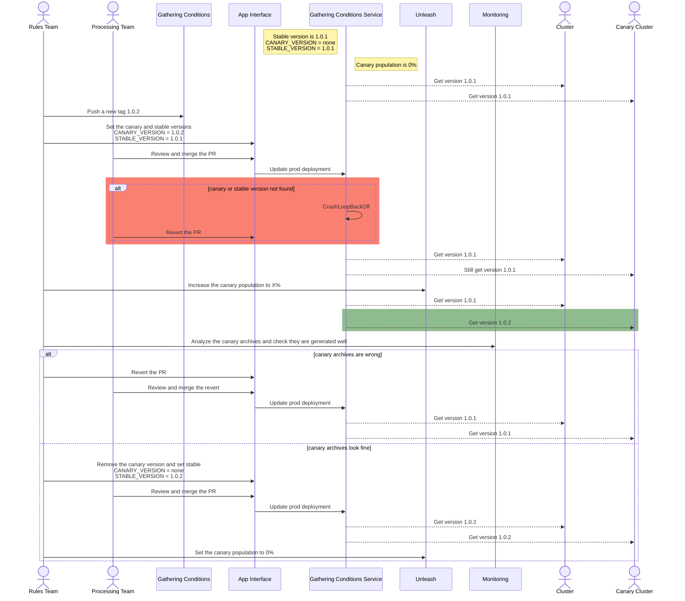

# Canary releases

There is a need to use canary releases in order to make sure newer versions
of the gathering conditions don't break the Insights Operator gatherer.

This is how a canary release would look like:

In case of an emergency release, we would just need to create the app-interface
Pull Request and ignore the Unleash settings.

In case there are new conditions published during a canary release, you can
update the `CANARY_VERSION` and start the sequence from the beginning.

Note that the stage environment is not mentioned in the whole diagram. The
idea is that the service logic is tested both in stage and production, but the
new conditions are shipped to production directly via environment variables. The
service has to download the conditions on startup and fail if there is any issue,
so that we can see the Crashloopback and revert the PR. As Kubernetes waits for
the new pods to be healthy before deleting the old ones, a corrupted conditions
file shouldn't affect any client.
